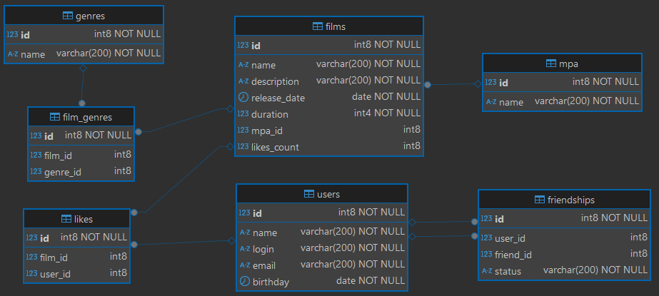

# Filmorate

---
**Filmorate** - это Spring Boot приложение для рекомендации фильмов на основе оценок друзей.\
Сервис позволяет пользователям:

* Получать персонализированные рекомендации
* Ставить оценки фильмам
* Добавлять друзей и видеть их предпочтения
* Просматривать топ фильмов по рейтингу
---
## Технологический стек

* Backend: Java 21, Spring Boot, Spring JDBC
* База данных: H2
* Тестирование: JUnit 5
* Инструменты: Maven, DBeaver, IntelliJ IDEA

## Структура базы данных

Приложение использует реляционную БД со следующими основными таблицами:

* films - информация о фильмах
* users - данные пользователей
* friendships - связи между пользователями
* likes - оценки фильмов
* genres и mpa - справочники жанров и возрастных рейтингов

```postgres-sql-sql
MERGE INTO genres
      KEY(id)
VALUES (1, 'Комедия'),
       (2, 'Драма'),
       (3, 'Мультфильм'),
       (4, 'Триллер'),
       (5, 'Документальный'),
       (6, 'Боевик');
       
MERGE INTO mpa
      KEY(id)
VALUES (1, 'G'),
       (2, 'PG'),
       (3, 'PG-13'),
       (4, 'R'),
       (5, 'NC-17');
```



## Функциональность
### USERS
**API Endpoints:**
* Получение всех пользователей\
  `GET /users` - список всех зарегистрированных пользователей
* Получение пользователя по ID\
  `GET /users/{id}` - данные конкретного пользователя
* Регистрация нового пользователя\
  `POST /users` - добавляет нового пользователя в систему
* Обновление данных пользователя\
  `PUT /users` - изменяет информацию о пользователе
* Удаление пользователя\
  `DELETE /users/{id}` - удаляет пользователя из системы
* Добавление в друзья\
  `PUT /users/{id}/friends/{friendId}` - создает дружескую связь
* Удаление из друзей\
  `DELETE /users/{id}/friends/{friendId}` - удаляет дружескую связь
* Список друзей\
  `GET /users/{id}/friends` - возвращает друзей пользователя
* Общие друзья\
  `GET /users/{id}/friends/common/{friendId}` - список общих друзей с другим пользователем

**Примеры запросов:**
1. `POST /users`\
request body:
```json
{
  "login": "dolore",
  "name": "Nick Name",
  "email": "mail@mail.ru",
  "birthday": "1946-08-20"
}
```
response (200 code)
```json
{
    "id": 1,
    "email": "mail@mail.ru",
    "login": "dolore",
    "name": "Nick Name",
    "birthday": "1946-08-20"
}
```
2. `GET /users/{id}/friends`\
response (200 code)
```json
[
    {
        "id": 1,
        "email": "mail@mail.ru",
        "login": "dolore",
        "name": "Nick Name",
        "birthday": "1946-08-20"
    }
]
```

**Валидация**
* Email должен быть уникальным и содержать '@'
* Логин не должен содержать пробелы
* Имя по умолчанию берется из логина
* Дата рождения не может быть в будущем
---
### FILMS
**API Endpoints:**
* Получение всех фильмов\
  `GET /films` - возвращает список всех зарегистрированных фильмов
* Получение фильма по ID\
  `GET /films/{id}` - возвращает данные конкретного фильма
* Добавление нового фильма\
  `POST /films` - создает новую запись о фильме
* Обновление информации о фильме\
  `PUT /films` - изменяет данные существующего фильма
* Удаление фильма\
  `DELETE /films/{id}` - удаляет фильм из системы
* Добавление лайка\
  `PUT /films/{id}/like/{userId}` - пользователь ставит оценку фильму
* Удаление лайка\
  `DELETE /films/{id}/like/{userId}` - пользователь удаляет свою оценку
* Топ фильмов\
  `GET /films/popular?count={n}` - возвращает N самых популярных фильмов (по умолчанию 10)

**Пример запроса:**
`POST /films`\
   request body:
```json
{
  "name": "film name",
  "description": "film description",
  "releaseDate": "1974-11-30",
  "duration": 169,
  "genres": [
    {
      "id": 3,
      "name": "Мультфильм"
    }
  ],
  "mpa": {
    "id": 1,
    "name": "G"
  }
}
```
response (200 code)
```json
{
  "id": 1,
  "name": "film name",
  "description": "film description",
  "releaseDate": "1974-11-30",
  "duration": 169,
  "rate": 0,
  "genres": [
    {
      "id": 3,
      "name": "Мультфильм"
    }
  ],
  "mpa": {
    "id": 1,
    "name": "G"
  }
}
```

**Валидация**
* Название не может быть пустым
* Описание ≤ 200 символов
* Дата релиза не раньше 28.12.1895
* Продолжительность > 0 минут
* Проверка существования жанров и рейтингов MPA

**Технические особенности:**
* Автоматическая установка рейтинга MPA
* Проверка дублирования лайков
* Оптимизированные запросы к БД
* Подробное логирование операций
---
### GENRES
**API Endpoints:**
* Получение всех жанров\
  `GET /genres` - возвращает список всех доступных жанров
* Получение жанра по ID\
  `GET /genres/{id}` - возвращает данные конкретного жанра

**Пример запросф:**
`GET /genres/{id}`\
response (200 code)
```json
{
    "id": 2,
    "name": "Драма"
}
```
---
### MPA
**API Endpoints:**
* Получение всех рейтингов\
  `GET /mpa` - список всех возрастных рейтингов
* Получение рейтинга по ID\
  `GET /mpa/{id}` - данные конкретного возрастного рейтинга

**Пример запроса:**
`GET /mpa/{id}`\
response (200 code)
```json
{
    "id": 5,
    "name": "NC-17"
}
```